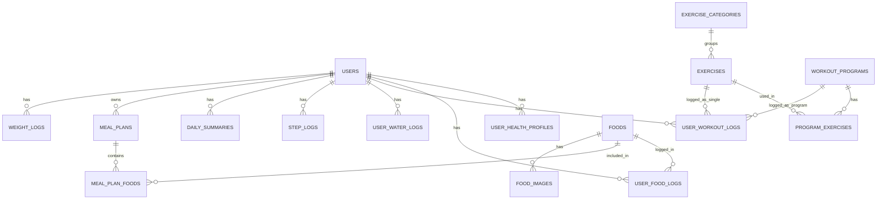

# Database Entity Overview

Tai lieu nay tong hop toan bo entity JPA trong du an (`src/main/java/com/example/wao_be/entity`) de ban nhanh chong nam duoc:
- Cac bang dang co
- Thuoc tinh (cot) cua tung bang
- Khoa chinh/khoa ngoai
- Quan he giua cac bang

## 1) Danh sach bang

| # | Entity | Table |
|---|---|---|
| 1 | `User` | `users` |
| 2 | `UserHealthProfile` | `user_health_profiles` |
| 3 | `Food` | `foods` |
| 4 | `FoodImage` | `food_images` |
| 5 | `UserFoodLog` | `user_food_logs` |
| 6 | `MealPlan` | `meal_plans` |
| 7 | `MealPlanFood` | `meal_plan_foods` |
| 8 | `ExerciseCategory` | `exercise_categories` |
| 9 | `Exercise` | `exercises` |
| 10 | `WorkoutProgram` | `workout_programs` |
| 11 | `ProgramExercise` | `program_exercises` |
| 12 | `UserWorkoutLog` | `user_workout_logs` |
| 13 | `UserWaterLog` | `user_water_logs` |
| 14 | `StepLog` | `step_logs` |
| 15 | `DailySummary` | `daily_summaries` |
| 16 | `WeightLog` | `weight_logs` |

## 2) Chi tiet tung bang

### `users` (`User`)

| Column | Type (Java) | Constraint / Mapping | Ghi chu |
|---|---|---|---|
| `id` | `Long` | PK, `@GeneratedValue(IDENTITY)` | Khoa chinh |
| `email` | `String` | `nullable=false`, `unique=true`, `length=150` | Email dang nhap |
| `password_hash` | `String` | `nullable=false` | Mat khau da ma hoa |
| `full_name` | `String` | `length=100` | Ho ten |
| `status` | `UserStatus` | `@Enumerated(STRING)`, `nullable=false`, `length=20` | Gia tri app default: `ACTIVE` |
| `created_at` | `LocalDateTime` | `@CreationTimestamp`, `updatable=false` | Thoi gian tao |
| `updated_at` | `LocalDateTime` | `@UpdateTimestamp` | Thoi gian cap nhat |
| `img` | `String` | `length=500` | Avatar URL |

Quan he 1-n (phan inverse):
- `users.id` <- `user_health_profiles.user_id`
- `users.id` <- `user_food_logs.user_id`
- `users.id` <- `user_workout_logs.user_id`
- `users.id` <- `step_logs.user_id`
- `users.id` <- `user_water_logs.user_id`
- `users.id` <- `daily_summaries.user_id`
- `users.id` <- `meal_plans.user_id`
- `users.id` <- `weight_logs.user_id`

### `user_health_profiles` (`UserHealthProfile`)

| Column | Type (Java) | Constraint / Mapping | Ghi chu |
|---|---|---|---|
| `id` | `Long` | PK, `@GeneratedValue(IDENTITY)` | Khoa chinh |
| `user_id` | `User` | FK, `nullable=false` | `ManyToOne -> users.id` |
| `gender` | `Gender` | `@Enumerated(STRING)`, `length=10` | `MALE`, `FEMALE`, `OTHER` |
| `dob` | `LocalDate` | - | Ngay sinh |
| `height_cm` | `Double` | - | Chieu cao |
| `weight_kg` | `Double` | - | Can nang |
| `activity_level` | `ActivityLevel` | `@Enumerated(STRING)`, `length=20` | Muc do van dong |
| `goal_type` | `GoalType` | `@Enumerated(STRING)`, `length=20` | Muc tieu |
| `target_calories` | `Double` | - | Tu dong tinh trong `@PrePersist/@PreUpdate` |
| `recorded_at` | `LocalDateTime` | `@CreationTimestamp`, `updatable=false` | Thoi diem ghi nhan |

Quan he:
- n-1: `user_health_profiles.user_id` -> `users.id`

### `foods` (`Food`)

| Column | Type (Java) | Constraint / Mapping | Ghi chu |
|---|---|---|---|
| `id` | `Long` | PK, `@GeneratedValue(IDENTITY)` | Khoa chinh |
| `name` | `String` | `nullable=false`, `length=200` | Ten mon |
| `serving_size` | `String` | `length=100` | Khau phan mac dinh |
| `calories` | `Double` | `nullable=false` | Kcal moi khau phan |
| `protein` | `Double` | - | g |
| `carbs` | `Double` | - | g |
| `fat` | `Double` | - | g |
| `is_verified` | `Boolean` | `nullable=false` | Default app: `false` |

Quan he 1-n (phan inverse):
- `foods.id` <- `user_food_logs.food_id`
- `foods.id` <- `meal_plan_foods.food_id`
- `foods.id` <- `food_images.food_id`

### `food_images` (`FoodImage`)

| Column | Type (Java) | Constraint / Mapping | Ghi chu |
|---|---|---|---|
| `id` | `Long` | PK, `@GeneratedValue(IDENTITY)` | Khoa chinh |
| `food_id` | `Food` | FK, `nullable=false` | `ManyToOne -> foods.id` |
| `file_name` | `String` | `nullable=false`, `length=255` | Ten file |
| `content_type` | `String` | `nullable=false`, `length=100` | MIME type |
| `file_size` | `Long` | `nullable=false` | Kich thuoc byte |
| `data` | `byte[]` | `@Lob`, `nullable=false`, `columnDefinition=LONGBLOB` | Du lieu anh |
| `created_at` | `LocalDateTime` | `nullable=false`, `updatable=false` | Set trong `@PrePersist` |
| `updated_at` | `LocalDateTime` | `nullable=false` | Set trong `@PrePersist/@PreUpdate` |

Quan he:
- n-1: `food_images.food_id` -> `foods.id`

### `user_food_logs` (`UserFoodLog`)

| Column | Type (Java) | Constraint / Mapping | Ghi chu |
|---|---|---|---|
| `id` | `Long` | PK, `@GeneratedValue(IDENTITY)` | Khoa chinh |
| `user_id` | `User` | FK, `nullable=false` | `ManyToOne -> users.id` |
| `food_id` | `Food` | FK, `nullable=false` | `ManyToOne -> foods.id` |
| `meal_type` | `MealType` | `@Enumerated(STRING)`, `nullable=false`, `length=20` | `BREAKFAST`, `LUNCH`, `DINNER`, `SNACK` |
| `serving_qty` | `Double` | `nullable=false` | So khau phan |
| `total_calories` | `Double` | `nullable=false` | Tu tinh trong lifecycle hook |
| `log_date` | `LocalDate` | `nullable=false` | Ngay an |

Quan he:
- n-1: `user_food_logs.user_id` -> `users.id`
- n-1: `user_food_logs.food_id` -> `foods.id`

### `meal_plans` (`MealPlan`)

| Column | Type (Java) | Constraint / Mapping | Ghi chu |
|---|---|---|---|
| `id` | `Long` | PK, `@GeneratedValue(IDENTITY)` | Khoa chinh |
| `name` | `String` | `nullable=false`, `length=200` | Ten plan |
| `description` | `String` | `columnDefinition=TEXT` | Mo ta |
| `total_calories` | `Double` | - | Tong calo plan |
| `type` | `MealPlanType` | `@Enumerated(STRING)`, `nullable=false`, `length=20` | `SYSTEM_SUGGESTION`, `USER_CUSTOM` |
| `user_id` | `User` | FK, nullable | Neu custom thi co user |
| `created_at` | `LocalDateTime` | `@CreationTimestamp`, `updatable=false` | Thoi diem tao |

Quan he:
- n-1: `meal_plans.user_id` -> `users.id` (co the null)
- 1-n inverse: `meal_plans.id` <- `meal_plan_foods.meal_plan_id`

### `meal_plan_foods` (`MealPlanFood`)

| Column | Type (Java) | Constraint / Mapping | Ghi chu |
|---|---|---|---|
| `id` | `Long` | PK, `@GeneratedValue(IDENTITY)` | Khoa chinh |
| `meal_plan_id` | `MealPlan` | FK, `nullable=false` | `ManyToOne -> meal_plans.id` |
| `food_id` | `Food` | FK, `nullable=false` | `ManyToOne -> foods.id` |
| `meal_type` | `UserFoodLog.MealType` | `@Enumerated(STRING)`, `nullable=false`, `length=20` | Bua an |
| `serving_qty` | `Double` | `nullable=false` | Default app: `1.0` |
| `calories` | `Double` | - | Tu dong tinh trong `@PrePersist/@PreUpdate` |

Quan he:
- n-1: `meal_plan_foods.meal_plan_id` -> `meal_plans.id`
- n-1: `meal_plan_foods.food_id` -> `foods.id`

### `exercise_categories` (`ExerciseCategory`)

| Column | Type (Java) | Constraint / Mapping | Ghi chu |
|---|---|---|---|
| `id` | `Long` | PK, `@GeneratedValue(IDENTITY)` | Khoa chinh |
| `name` | `String` | `nullable=false`, `unique=true`, `length=100` | Ten nhom bai tap |
| `description` | `String` | `columnDefinition=TEXT` | Mo ta |

Quan he 1-n (phan inverse):
- `exercise_categories.id` <- `exercises.category_id`

### `exercises` (`Exercise`)

| Column | Type (Java) | Constraint / Mapping | Ghi chu |
|---|---|---|---|
| `id` | `Long` | PK, `@GeneratedValue(IDENTITY)` | Khoa chinh |
| `category_id` | `ExerciseCategory` | FK, nullable | `ManyToOne -> exercise_categories.id` |
| `name` | `String` | `nullable=false`, `length=200` | Ten bai tap |
| `video_url` | `String` | - | Link video |
| `calories_per_min` | `Double` | - | Kcal/phut |
| `description` | `String` | `columnDefinition=TEXT` | Mo ta |

Quan he:
- n-1: `exercises.category_id` -> `exercise_categories.id`
- 1-n inverse: `exercises.id` <- `program_exercises.exercise_id`
- 1-n inverse: `exercises.id` <- `user_workout_logs.exercise_id`

### `workout_programs` (`WorkoutProgram`)

| Column | Type (Java) | Constraint / Mapping | Ghi chu |
|---|---|---|---|
| `id` | `Long` | PK, `@GeneratedValue(IDENTITY)` | Khoa chinh |
| `name` | `String` | `nullable=false`, `length=200` | Ten chuong trinh |
| `level` | `ProgramLevel` | `@Enumerated(STRING)`, `nullable=false`, `length=15` | `BEGINNER`, `INTERMEDIATE`, `PRO` |
| `estimated_duration` | `Integer` | - | Phut uoc tinh |
| `description` | `String` | `columnDefinition=TEXT` | Mo ta |

Quan he 1-n (phan inverse):
- `workout_programs.id` <- `program_exercises.program_id`
- `workout_programs.id` <- `user_workout_logs.program_id`

### `program_exercises` (`ProgramExercise`)

| Column | Type (Java) | Constraint / Mapping | Ghi chu |
|---|---|---|---|
| `id` | `Long` | PK, `@GeneratedValue(IDENTITY)` | Khoa chinh |
| `program_id` | `WorkoutProgram` | FK, `nullable=false` | `ManyToOne -> workout_programs.id` |
| `exercise_id` | `Exercise` | FK, `nullable=false` | `ManyToOne -> exercises.id` |
| `order_index` | `Integer` | `nullable=false` | Thu tu bai trong chuong trinh |
| `sets` | `Integer` | `nullable=false` | So set |
| `reps` | `Integer` | `nullable=false` | So rep |
| `rest_time_sec` | `Integer` | - | Nghi giua set |

Quan he:
- n-1: `program_exercises.program_id` -> `workout_programs.id`
- n-1: `program_exercises.exercise_id` -> `exercises.id`

### `user_workout_logs` (`UserWorkoutLog`)

| Column | Type (Java) | Constraint / Mapping | Ghi chu |
|---|---|---|---|
| `id` | `Long` | PK, `@GeneratedValue(IDENTITY)` | Khoa chinh |
| `user_id` | `User` | FK, `nullable=false` | `ManyToOne -> users.id` |
| `exercise_id` | `Exercise` | FK, nullable | Log tap bai le |
| `program_id` | `WorkoutProgram` | FK, nullable | Log tap theo chuong trinh |
| `duration_min` | `Integer` | `nullable=false` | Thoi gian tap |
| `calories_burned` | `Double` | - | Tu tinh neu co `exercise` |
| `log_date` | `LocalDate` | `nullable=false` | Ngay tap |
| `note` | `String` | `columnDefinition=TEXT` | Ghi chu |

Quan he:
- n-1: `user_workout_logs.user_id` -> `users.id`
- n-1: `user_workout_logs.exercise_id` -> `exercises.id` (nullable)
- n-1: `user_workout_logs.program_id` -> `workout_programs.id` (nullable)

### `user_water_logs` (`UserWaterLog`)

| Column | Type (Java) | Constraint / Mapping | Ghi chu |
|---|---|---|---|
| `id` | `Long` | PK, `@GeneratedValue(IDENTITY)` | Khoa chinh |
| `user_id` | `User` | FK, `nullable=false` | `ManyToOne -> users.id` |
| `amount_ml` | `Integer` | `nullable=false` | Luong nuoc |
| `log_time` | `LocalDateTime` | `nullable=false` | Thoi diem uong |
| `log_date` | `LocalDate` | `nullable=false` | Tu set o `@PrePersist` neu chua co |

Quan he:
- n-1: `user_water_logs.user_id` -> `users.id`

### `step_logs` (`StepLog`)

| Column | Type (Java) | Constraint / Mapping | Ghi chu |
|---|---|---|---|
| `id` | `Long` | PK, `@GeneratedValue(IDENTITY)` | Khoa chinh |
| `user_id` | `User` | FK, `nullable=false` | `ManyToOne -> users.id` |
| `step_count` | `Integer` | `nullable=false` | So buoc |
| `log_date` | `LocalDate` | `nullable=false` | Ngay ghi log |

Quan he:
- n-1: `step_logs.user_id` -> `users.id`

### `daily_summaries` (`DailySummary`)

> Bang nay dung khoa chinh tong hop (`@IdClass`) gom: `user_id` + `log_date`.

| Column | Type (Java) | Constraint / Mapping | Ghi chu |
|---|---|---|---|
| `user_id` | `User` | PK (1 phan), FK, `nullable=false` | `ManyToOne -> users.id` |
| `log_date` | `LocalDate` | PK (1 phan), `nullable=false` | Ngay tong hop |
| `total_cal_in` | `Double` | - | Default app: `0.0` |
| `total_cal_out` | `Double` | - | Default app: `0.0` |
| `total_water` | `Integer` | - | Default app: `0` |
| `total_steps` | `Integer` | - | Default app: `0` |
| `is_goal_achieved` | `Boolean` | - | Default app: `false` |

Quan he:
- n-1: `daily_summaries.user_id` -> `users.id`

### `weight_logs` (`WeightLog`)

| Column | Type (Java) | Constraint / Mapping | Ghi chu |
|---|---|---|---|
| `id` | `Long` | PK, `@GeneratedValue(IDENTITY)` | Khoa chinh |
| `user_id` | `User` | FK, `nullable=false` | `ManyToOne -> users.id` |
| `old_weight` | `Double` | - | Can nang cu |
| `new_weight` | `Double` | `nullable=false` | Can nang moi |
| `change_amount` | `Double` | - | Tu tinh trong `@PrePersist` |
| `note` | `String` | - | Ghi chu |
| `logged_at` | `LocalDateTime` | `@CreationTimestamp`, `updatable=false` | Thoi diem log |

Quan he:
- n-1: `weight_logs.user_id` -> `users.id`

## 3) Ban do quan he tong quan

## 4) Ghi chu ky thuat

- Tai lieu duoc tong hop tu annotation JPA trong source code, khong doc truc tiep tu schema DB migration.
- Cac gia tri `@Builder.Default` la default o tang application, khong chac chan la DB default constraint.
- Cac cot duoc tinh trong `@PrePersist/@PreUpdate`:
  - `user_health_profiles.target_calories`
  - `meal_plan_foods.calories`
  - `user_food_logs.total_calories`
  - `user_workout_logs.calories_burned` (chi khi du dieu kien)
  - `user_water_logs.log_date` (set neu null)
  - `weight_logs.change_amount`

