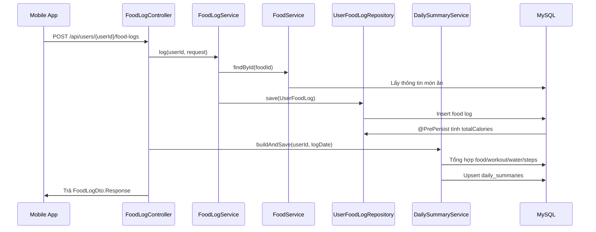
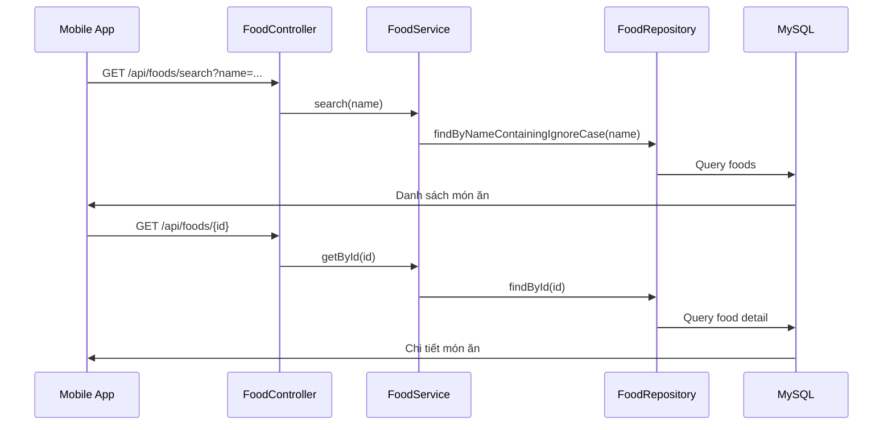
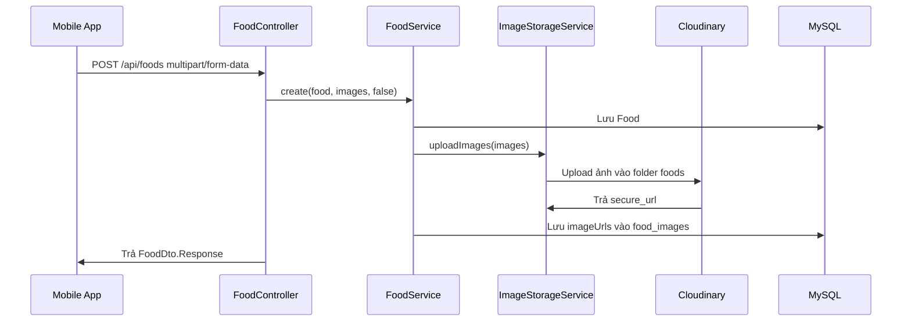
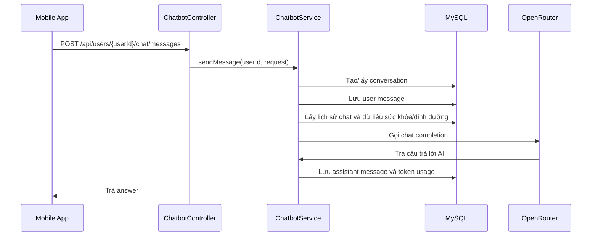

# Báo cáo kỹ thuật chức năng cá nhân: Quản lý món ăn hằng ngày, tìm kiếm món ăn và Chatbot AI

## 1. Thông tin chung

- Hệ thống: Wao - ứng dụng theo dõi sức khỏe, dinh dưỡng và tập luyện.
- Repo backend: `Wao_be`.
- Công nghệ chính: Java Spring Boot, Spring Web, Spring Data JPA, Hibernate, MySQL, Lombok, Maven.
- API gọi ngoài:
  - Cloudinary: upload và xóa ảnh món ăn.
  - OpenRouter: gọi mô hình AI để tư vấn ăn uống, tập luyện và sức khỏe.
- Nhóm chức năng cá nhân phụ trách:
  - Quản lý món ăn hằng ngày: xem calo nạp vào trong ngày, thêm/xóa món ăn theo bữa sáng, trưa, tối, ăn nhẹ.
  - Tìm kiếm món ăn: tìm món trong danh mục để thêm vào bữa ăn.
  - Xem chi tiết món ăn: xem thông tin dinh dưỡng như calo, protein, carb, fat, khẩu phần và ảnh.
  - Thêm món ăn mới: cho phép người dùng tạo món ăn mới trong hệ thống.
  - Chatbot AI: tư vấn các vấn đề liên quan đến ăn uống, tập luyện, sức khỏe.

## 2. Danh sách chức năng được phân công

### 2.1. Quản lý món ăn hằng ngày

Chức năng cho phép người dùng ghi lại các món đã ăn trong ngày theo từng loại bữa:

- `BREAKFAST`: bữa sáng.
- `LUNCH`: bữa trưa.
- `DINNER`: bữa tối.
- `SNACK`: bữa phụ/ăn nhẹ.

Khi người dùng thêm món vào nhật ký ăn uống, backend lưu thông tin món, số khẩu phần, ngày ghi log và loại bữa. Tổng calo của bản ghi được tính tự động theo công thức:

```text
totalCalories = food.calories * servingQty
```

Sau khi thêm món ăn, backend gọi `DailySummaryService.buildAndSave(...)` để cập nhật tổng calo nạp vào trong ngày. Mobile app có thể đọc `daily_summaries` hoặc nutrition statistics để hiển thị lượng calo người dùng đã ăn trong ngày.

### 2.2. Xem, thêm, xóa món đã thêm vào bữa ăn

Backend cung cấp API để:

- Thêm món vào nhật ký ăn uống của user.
- Xem toàn bộ món ăn đã log theo ngày.
- Xem món ăn theo ngày và loại bữa.
- Xem món ăn theo loại bữa.
- Xóa món đã log khỏi nhật ký ăn uống.

Sau khi thêm hoặc xóa food log, hệ thống cập nhật lại tổng kết ngày để dữ liệu dashboard không bị lệch.

### 2.3. Tìm kiếm món ăn

Chức năng tìm kiếm món ăn cho phép người dùng nhập tên món và nhận danh sách món phù hợp. Backend tìm kiếm theo tên món bằng query không phân biệt chữ hoa/thường:

```java
findByNameContainingIgnoreCase(name)
```

Nếu không truyền từ khóa, API trả về toàn bộ danh sách món ăn trong hệ thống.

### 2.4. Xem chi tiết món ăn

Người dùng có thể mở chi tiết một món ăn để xem:

- Tên món.
- Khẩu phần.
- Calo.
- Protein.
- Carbohydrate.
- Fat.
- Trạng thái xác minh.
- Loại bữa phù hợp.
- Ảnh món ăn.

Trong entity và DTO đã có thêm các trường `ingredients` và `containsAllergens` để phục vụ thông tin thành phần/dị ứng. Cần lưu ý khi hoàn thiện chức năng chi tiết món ăn, service mapper phải set đầy đủ các trường này từ entity sang response để frontend hiển thị trọn vẹn.

### 2.5. Thêm món ăn mới

Người dùng có thể tạo món ăn mới bằng form-data. Dữ liệu gồm thông tin dinh dưỡng và ảnh món ăn nếu có. Ảnh được upload lên Cloudinary, sau đó backend lưu URL ảnh vào bảng `food_images`.

Backend phân biệt:

- Người dùng tự tạo món: `isVerified = false`.
- Admin tạo món đã xác minh: `isVerified = true`.

### 2.6. Chatbot AI

Chatbot AI cho phép người dùng hỏi về:

- Ăn uống và calo.
- Gợi ý meal plan.
- Nhật ký ăn uống.
- Uống nước.
- Tập luyện.
- Cân nặng.
- Thói quen sức khỏe.

Backend lưu cuộc trò chuyện, lưu từng message của user/assistant, dựng ngữ cảnh từ dữ liệu cá nhân của user và gọi OpenRouter để sinh câu trả lời bằng tiếng Việt.

## 3. Kiến trúc chi tiết hệ thống

### 3.1. Kiến trúc tổng quan

```text
Mobile App
  |
  | REST API
  v
Controller Layer
  |
  v
Service Layer
  |
  v
Repository Layer
  |
  v
MySQL Database
```

Các lớp chính:

- `Controller`: định nghĩa endpoint cho food, food log, daily summary, statistics và chat.
- `Service`: xử lý nghiệp vụ tạo món, tìm món, ghi nhật ký ăn uống, tính tổng calo, dựng prompt chatbot.
- `Repository`: truy vấn database bằng Spring Data JPA.
- `Entity`: ánh xạ bảng trong database.
- `DTO`: định nghĩa request/response giữa mobile app và backend.
- `Config`: cấu hình Cloudinary và OpenRouter.

### 3.2. Luồng thêm món vào nhật ký ăn uống



### 3.3. Luồng tìm kiếm và xem chi tiết món ăn



### 3.4. Luồng thêm món ăn mới có ảnh



### 3.5. Luồng Chatbot AI



## 4. Code đáp ứng chức năng

### 4.1. Nhóm code quản lý danh mục món ăn

| File | Vai trò |
|---|---|
| `src/main/java/com/example/wao_be/controller/FoodController.java` | Định nghĩa API tạo, tìm kiếm, xem chi tiết, cập nhật và xóa món ăn. |
| `src/main/java/com/example/wao_be/service/FoodService.java` | Xử lý nghiệp vụ món ăn: tạo món, upload ảnh, tìm kiếm, cập nhật, xóa. |
| `src/main/java/com/example/wao_be/dto/FoodDto.java` | Định nghĩa request/response của món ăn. |
| `src/main/java/com/example/wao_be/entity/Food.java` | Entity ánh xạ bảng `foods` và collection ảnh `food_images`. |
| `src/main/java/com/example/wao_be/repository/FoodRepository.java` | Query món ăn theo tên, trạng thái xác minh, meal type và khoảng calo. |
| `src/main/java/com/example/wao_be/service/ImageStorageService.java` | Upload/xóa ảnh món ăn qua Cloudinary. |
| `src/main/java/com/example/wao_be/config/CloudinaryConfig.java` | Khởi tạo bean Cloudinary từ cấu hình. |

Các hàm chính trong `FoodService`:

| Hàm | Mô tả |
|---|---|
| `create(FoodDto.Request req, List<MultipartFile> images, boolean isVerified)` | Tạo món ăn mới, upload ảnh nếu có và trả response. |
| `search(String name)` | Tìm món ăn theo tên; nếu từ khóa rỗng thì trả toàn bộ món. |
| `getById(Long id)` | Lấy chi tiết món ăn theo ID. |
| `update(Long id, FoodDto.Request req, List<MultipartFile> images)` | Cập nhật thông tin món và upload thêm ảnh mới. |
| `delete(Long id)` | Xóa món ăn và xóa ảnh trên Cloudinary theo cơ chế best-effort. |
| `findById(Long id)` | Hàm dùng chung để lấy món, ném lỗi nếu không tồn tại. |
| `uploadImages(...)` | Gọi `ImageStorageService` để upload ảnh. |
| `toResponse(Food f)` | Map entity `Food` sang `FoodDto.Response`. |

### 4.2. Nhóm code nhật ký ăn uống hằng ngày

| File | Vai trò |
|---|---|
| `src/main/java/com/example/wao_be/controller/FoodLogController.java` | Định nghĩa API thêm, xem và xóa món đã ăn theo user. |
| `src/main/java/com/example/wao_be/service/FoodLogService.java` | Xử lý nghiệp vụ ghi food log, tính preference vector và đọc log theo ngày/bữa. |
| `src/main/java/com/example/wao_be/dto/FoodLogDto.java` | Định nghĩa request/response cho nhật ký ăn uống. |
| `src/main/java/com/example/wao_be/entity/UserFoodLog.java` | Entity ánh xạ bảng `user_food_logs`, tự tính tổng calo bằng lifecycle hook. |
| `src/main/java/com/example/wao_be/repository/UserFoodLogRepository.java` | Query food log theo user, ngày, khoảng ngày, meal type và tính tổng calo. |
| `src/main/java/com/example/wao_be/service/DailySummaryService.java` | Cập nhật tổng calo nạp vào trong `daily_summaries`. |
| `src/main/java/com/example/wao_be/service/StatisticsService.java` | Cung cấp thống kê nutrition theo ngày/khoảng ngày. |

Các hàm chính trong `FoodLogService`:

| Hàm | Mô tả |
|---|---|
| `log(Long userId, FoodLogDto.Request req)` | Thêm món vào nhật ký ăn uống của user. |
| `getByUserAndDate(Long userId, LocalDate date)` | Lấy toàn bộ món đã ăn trong một ngày. |
| `getByMealType(UserFoodLog.MealType mealType)` | Lấy log theo loại bữa. |
| `getByUserDateAndMealType(Long userId, LocalDate date, MealType mealType)` | Lấy món đã ăn theo user, ngày và bữa. |
| `delete(Long logId)` | Xóa một food log theo ID. |
| `learnUserPreference(Long userId, Food food)` | Cập nhật preference vector trong hồ sơ sức khỏe dựa trên món user đã ăn. |

### 4.3. Nhóm code thống kê calo ăn uống

| File | Vai trò |
|---|---|
| `src/main/java/com/example/wao_be/controller/StatisticsController.java` | API thống kê dinh dưỡng theo ngày/khoảng ngày. |
| `src/main/java/com/example/wao_be/service/StatisticsService.java` | Gom nhóm dữ liệu dinh dưỡng theo ngày, tuần hoặc tháng. |
| `src/main/java/com/example/wao_be/dto/StatisticsDto.java` | DTO cho response thống kê nutrition/weight. |

Các hàm liên quan:

| Hàm | Mô tả |
|---|---|
| `getDailyNutrition(Long userId, LocalDate date)` | Tính tổng calories, protein, carbs, fat của một ngày. |
| `getNutritionSeries(Long userId, LocalDate from, LocalDate to, GroupBy groupBy)` | Trả chuỗi dữ liệu nutrition theo ngày/tuần/tháng để frontend vẽ biểu đồ. |
| `initNutritionBuckets(...)` | Khởi tạo các bucket thời gian để cả ngày không có log vẫn có điểm dữ liệu bằng 0. |
| `bucketDate(...)` | Chuyển ngày log thành bucket theo DAY/WEEK/MONTH. |

### 4.4. Nhóm code Chatbot AI

| File | Vai trò |
|---|---|
| `src/main/java/com/example/wao_be/controller/ChatbotController.java` | Định nghĩa API quản lý conversation và gửi message. |
| `src/main/java/com/example/wao_be/service/ChatbotService.java` | Xử lý nghiệp vụ chatbot, dựng context, gọi AI, lưu message. |
| `src/main/java/com/example/wao_be/dto/ChatbotDto.java` | DTO cho gửi tin nhắn, danh sách hội thoại, chi tiết hội thoại. |
| `src/main/java/com/example/wao_be/entity/ChatConversation.java` | Entity bảng `chat_conversations`. |
| `src/main/java/com/example/wao_be/entity/ChatMessage.java` | Entity bảng `chat_messages`. |
| `src/main/java/com/example/wao_be/repository/ChatConversationRepository.java` | Query conversation theo user và thời gian cập nhật. |
| `src/main/java/com/example/wao_be/repository/ChatMessageRepository.java` | Query message theo conversation. |
| `src/main/java/com/example/wao_be/service/OpenRouterClient.java` | HTTP client gọi OpenRouter chat completion API. |
| `src/main/java/com/example/wao_be/config/OpenRouterProperties.java` | Cấu hình endpoint, model, API key, token, timeout, temperature. |

Các hàm chính trong `ChatbotService`:

| Hàm | Mô tả |
|---|---|
| `sendMessage(Long userId, SendMessageRequest request)` | Lưu user message, dựng context, gọi OpenRouter, lưu assistant message và trả câu trả lời. |
| `getConversations(Long userId)` | Lấy danh sách cuộc trò chuyện của user. |
| `getConversationDetail(Long userId, Long conversationId)` | Lấy chi tiết cuộc trò chuyện kèm danh sách message. |
| `deleteConversation(Long userId, Long conversationId)` | Xóa một conversation của user. |
| `resolveConversation(...)` | Dùng conversation cũ nếu có ID, hoặc tạo conversation mới. |
| `buildContextMessages(...)` | Lấy lịch sử chat gần nhất và thêm dữ liệu cá nhân của user vào prompt. |
| `buildUserDataContext(Long userId)` | Dựng ngữ cảnh từ food logs, meal plans, foods, profile, weight, workout, steps và water. |
| `normalizeAnswer(...)` | Chuẩn hóa câu trả lời AI, giới hạn độ dài và bỏ xuống dòng thừa. |

## 5. API liên quan

### 5.1. API thêm món ăn mới

```http
POST /api/foods
Content-Type: multipart/form-data
```

Các part:

- `food`: JSON chứa thông tin món ăn.
- `images`: danh sách ảnh, optional.

Ví dụ `food` part:

```json
{
  "name": "Cơm gà",
  "servingSize": "1 phần",
  "calories": 650,
  "protein": 35,
  "carbs": 78,
  "fat": 18,
  "suitableMealTypes": "LUNCH,DINNER",
  "ingredients": "cơm, thịt gà, rau, nước sốt",
  "containsAllergens": "SOY"
}
```

Mục đích: cho phép user tự tạo món ăn mới. Món do user tạo có `isVerified = false`.

### 5.2. API admin thêm món đã xác minh

```http
POST /api/foods/admin
Content-Type: multipart/form-data
```

Mục đích: tạo món ăn có `isVerified = true`, dùng cho danh mục món ăn chuẩn của hệ thống.

### 5.3. API tìm kiếm món ăn

```http
GET /api/foods/search?name=keyword
```

Mục đích: tìm món ăn theo tên để người dùng chọn và thêm vào bữa ăn. Nếu `name` rỗng hoặc không truyền, API trả toàn bộ món ăn.

### 5.4. API xem chi tiết món ăn

```http
GET /api/foods/{id}
```

Mục đích: lấy thông tin chi tiết của một món ăn gồm calo, protein, carb, fat, khẩu phần, ảnh và metadata liên quan.

### 5.5. API cập nhật/xóa món ăn

```http
PUT /api/foods/{id}
DELETE /api/foods/{id}
```

Mục đích:

- `PUT`: cập nhật thông tin món và có thể upload thêm ảnh.
- `DELETE`: xóa món khỏi database và xóa ảnh Cloudinary theo cơ chế best-effort.

### 5.6. API thêm món vào nhật ký ăn uống

```http
POST /api/users/{userId}/food-logs
```

Request mẫu:

```json
{
  "foodId": 1,
  "mealType": "BREAKFAST",
  "servingQty": 1.5,
  "logDate": "2026-05-27"
}
```

Response chính:

```json
{
  "id": 10,
  "userId": 5,
  "foodId": 1,
  "foodName": "Cơm gà",
  "mealType": "BREAKFAST",
  "servingQty": 1.5,
  "totalCalories": 975,
  "logDate": "2026-05-27"
}
```

### 5.7. API xem món đã ăn theo ngày/bữa

```http
GET /api/users/{userId}/food-logs/by-date?date=YYYY-MM-DD
GET /api/users/{userId}/food-logs/by-date-and-meal-type?date=YYYY-MM-DD&mealType=BREAKFAST
GET /api/users/{userId}/food-logs/by-meal-type?mealType=SNACK
```

Mục đích:

- `by-date`: xem toàn bộ món đã ăn trong ngày.
- `by-date-and-meal-type`: xem món theo ngày và bữa.
- `by-meal-type`: xem log theo loại bữa.

### 5.8. API xóa món khỏi nhật ký ăn uống

```http
DELETE /api/users/{userId}/food-logs/{logId}
```

Mục đích: xóa một món đã thêm vào nhật ký ăn uống.

### 5.9. API xem calo/dinh dưỡng trong ngày

```http
GET /api/users/{userId}/statistics/nutrition/daily?date=YYYY-MM-DD
```

Mục đích: xem tổng calo, protein, carbs và fat trong một ngày.

### 5.10. API xem biểu đồ dinh dưỡng

```http
GET /api/users/{userId}/statistics/nutrition?from=YYYY-MM-DD&to=YYYY-MM-DD&groupBy=DAY
GET /api/users/{userId}/statistics/nutrition?from=YYYY-MM-DD&to=YYYY-MM-DD&groupBy=WEEK
GET /api/users/{userId}/statistics/nutrition?from=YYYY-MM-DD&to=YYYY-MM-DD&groupBy=MONTH
```

Mục đích: cung cấp dữ liệu chuỗi thời gian để frontend vẽ biểu đồ theo ngày, tuần hoặc tháng.

### 5.11. API daily summary

```http
GET /api/users/{userId}/daily-summaries/today
GET /api/users/{userId}/daily-summaries?date=YYYY-MM-DD
GET /api/users/{userId}/daily-summaries/history?from=YYYY-MM-DD&to=YYYY-MM-DD
POST /api/users/{userId}/daily-summaries/refresh?date=YYYY-MM-DD
```

Mục đích: lấy tổng kết ngày gồm calo nạp vào, calo tiêu hao, nước, bước chân và trạng thái hoàn thành mục tiêu.

### 5.12. API Chatbot AI

```http
GET /api/users/{userId}/chat/conversations
GET /api/users/{userId}/chat/conversations/{conversationId}
POST /api/users/{userId}/chat/messages
DELETE /api/users/{userId}/chat/conversations/{conversationId}
```

Request gửi tin nhắn:

```json
{
  "conversationId": 1,
  "message": "Hôm nay tôi nên ăn gì để đủ protein?"
}
```

Nếu `conversationId` không được gửi, backend tạo cuộc trò chuyện mới.

## 6. Bảng trong cơ sở dữ liệu

### 6.1. Bảng `foods`

Bảng lưu danh mục món ăn.

| Cột | Ý nghĩa |
|---|---|
| `id` | Khóa chính. |
| `name` | Tên món ăn. |
| `serving_size` | Mô tả khẩu phần. |
| `calories` | Calo trên mỗi khẩu phần. |
| `protein` | Protein tính bằng gram. |
| `carbs` | Carbohydrate tính bằng gram. |
| `fat` | Chất béo tính bằng gram. |
| `is_verified` | Món đã được admin xác minh hay do user tự tạo. |
| `feature_vector` | Vector đặc trưng dùng cho gợi ý/cá nhân hóa. |
| `ingredients` | Thành phần món ăn. |
| `contains_allergens` | Thông tin dị ứng nếu có. |
| `suitable_meal_types` | Các bữa phù hợp, ví dụ `BREAKFAST,LUNCH`. |

### 6.2. Bảng `food_images`

Bảng lưu danh sách URL ảnh món ăn dưới dạng `@ElementCollection`.

| Cột | Ý nghĩa |
|---|---|
| `foods_id` | ID món ăn. |
| `image_url` | URL ảnh đã upload lên Cloudinary. |

### 6.3. Bảng `user_food_logs`

Bảng lưu nhật ký ăn uống của từng user.

| Cột | Ý nghĩa |
|---|---|
| `id` | Khóa chính. |
| `user_id` | User ghi nhật ký. |
| `food_id` | Món ăn được thêm vào bữa. |
| `meal_type` | Loại bữa: `BREAKFAST`, `LUNCH`, `DINNER`, `SNACK`. |
| `serving_qty` | Số khẩu phần. |
| `total_calories` | Tổng calo của bản ghi. |
| `log_date` | Ngày ghi nhật ký. |

### 6.4. Bảng `daily_summaries`

Bảng tổng hợp dữ liệu theo ngày.

| Cột | Ý nghĩa |
|---|---|
| `user_id` | User sở hữu dữ liệu tổng kết. |
| `log_date` | Ngày tổng kết. |
| `total_cal_in` | Tổng calo nạp vào từ `user_food_logs`. |
| `total_cal_out` | Tổng calo tiêu hao từ workout. |
| `total_water` | Tổng nước uống. |
| `total_steps` | Tổng bước chân. |
| `is_goal_achieved` | Trạng thái đạt mục tiêu ngày. |

### 6.5. Bảng `chat_conversations`

Bảng lưu cuộc trò chuyện chatbot.

| Cột | Ý nghĩa |
|---|---|
| `id` | Khóa chính. |
| `user_id` | User sở hữu cuộc trò chuyện. |
| `title` | Tiêu đề cuộc trò chuyện, lấy từ message đầu tiên. |
| `model` | Model AI được sử dụng. |
| `created_at` | Thời điểm tạo. |
| `updated_at` | Thời điểm cập nhật cuối. |

### 6.6. Bảng `chat_messages`

Bảng lưu từng tin nhắn trong cuộc trò chuyện.

| Cột | Ý nghĩa |
|---|---|
| `id` | Khóa chính. |
| `conversation_id` | Cuộc trò chuyện chứa message. |
| `role` | Vai trò: `USER`, `ASSISTANT`, `SYSTEM`. |
| `content` | Nội dung tin nhắn. |
| `prompt_tokens` | Số token prompt. |
| `completion_tokens` | Số token completion. |
| `total_tokens` | Tổng token. |
| `created_at` | Thời điểm tạo message. |

## 7. Xử lý nghiệp vụ quan trọng

### 7.1. Tính tổng calo món đã ăn

Trong `UserFoodLog`, hàm `computeCalories()` được gắn `@PrePersist` và `@PreUpdate`. Trước khi insert/update vào database, Hibernate tự tính:

```java
totalCalories = food.getCalories() * servingQty;
```

Nhờ đó frontend không cần tự tính tổng calo của từng log.

### 7.2. Cập nhật tổng kết ngày

Sau khi thêm food log, controller gọi:

```java
dailySummaryService.buildAndSave(userId, req.getLogDate());
```

`DailySummaryService` gọi repository để tính:

```java
foodLogRepository.sumCaloriesByUserIdAndLogDate(userId, date);
```

Kết quả được lưu vào `daily_summaries.total_cal_in`.

### 7.3. Gom nhóm thống kê dinh dưỡng

`StatisticsService.getNutritionSeries(...)` tạo các bucket theo:

- `DAY`: từng ngày.
- `WEEK`: ngày thứ hai đầu tuần.
- `MONTH`: ngày đầu tháng.

Sau đó service cộng tổng calo/protein/carbs/fat vào từng bucket. Cách này giúp frontend vẽ biểu đồ cột/đường ổn định vì các ngày không có dữ liệu vẫn có bucket bằng 0.

### 7.4. Cá nhân hóa thông qua preference vector

Sau khi user thêm món vào nhật ký ăn uống, `FoodLogService.learnUserPreference(...)` cập nhật `preferenceVector` trong hồ sơ sức khỏe nếu món ăn có `featureVector`.

Ý nghĩa:

- Nếu user chưa có preference vector, hệ thống lấy vector của món ăn đầu tiên để khởi tạo.
- Nếu đã có vector, hệ thống cập nhật bằng `VectorUtils.updatePreferenceVector(...)`.
- Dữ liệu này có thể phục vụ gợi ý món ăn/meal plan cá nhân hóa.

### 7.5. Prompt và ngữ cảnh của Chatbot AI

`ChatbotService` dùng system prompt để giới hạn chatbot trong phạm vi:

- Dinh dưỡng.
- Calo.
- Meal planning.
- Food logging.
- Hydration.
- Workout.
- Weight tracking.
- Thói quen sức khỏe.

Trước khi gọi AI, backend dựng thêm ngữ cảnh từ CSDL:

- Hồ sơ sức khỏe mới nhất.
- Cân nặng gần nhất.
- Tổng calo hôm nay.
- Workout hôm nay và 7 ngày gần đây.
- Số bước hôm nay.
- Nước uống hôm nay.
- Nhật ký ăn uống 7 ngày gần đây.
- Meal plan user tự tạo.
- Một số món ăn mẫu đã xác minh.

Nhờ vậy câu trả lời của chatbot có liên quan hơn đến dữ liệu thực tế của user.

### 7.6. Gọi OpenRouter

`OpenRouterClient.chat(...)` tạo HTTP request đến OpenRouter:

- Method: `POST`.
- Endpoint mặc định: `https://openrouter.ai/api/v1/chat/completions`.
- Header: `Authorization: Bearer <api-key>`.
- Body gồm `model`, `messages`, `temperature`, `max_tokens`, `stream=false`.

Kết quả trả về được parse bằng Jackson để lấy nội dung câu trả lời và token usage.

### 7.7. Upload ảnh món ăn lên Cloudinary

`ImageStorageService.uploadImages(...)` nhận danh sách `MultipartFile`, upload từng ảnh vào folder `foods` trên Cloudinary và trả danh sách `secure_url`.

Khi xóa món ăn, `FoodService.delete(...)` gọi `ImageStorageService.deleteImage(...)` để xóa ảnh remote theo cơ chế best-effort. Nếu xóa ảnh remote lỗi, bản ghi database vẫn được xóa thành công.

## 8. Hướng dẫn cài đặt và triển khai

### 8.1. Yêu cầu môi trường

- JDK 21 theo cấu hình `pom.xml`.
- Maven hoặc Maven Wrapper có sẵn trong repo.
- MySQL đang chạy.
- Tài khoản Cloudinary nếu dùng upload ảnh món ăn.
- OpenRouter API key nếu dùng Chatbot AI.

### 8.2. Cấu hình database

Kiểm tra `src/main/resources/application.properties`:

```properties
spring.datasource.url=jdbc:mysql://localhost:3306/wao
spring.datasource.username=...
spring.datasource.password=...
spring.jpa.hibernate.ddl-auto=update
```

### 8.3. Cấu hình Cloudinary

```properties
cloudinary.cloud-name=...
cloudinary.api-key=...
cloudinary.api-secret=...
```

Nếu thiếu cấu hình này, API thêm món có ảnh sẽ lỗi khi upload ảnh.

### 8.4. Cấu hình OpenRouter

```properties
openrouter.base-url=https://openrouter.ai/api/v1/chat/completions
openrouter.api-key=...
openrouter.model=...
openrouter.site-url=http://localhost:8080
openrouter.app-name=Wao Backend
```

Nếu thiếu `openrouter.api-key`, `OpenRouterClient` sẽ ném lỗi:

```text
Missing OPENROUTER API key. Configure openrouter.api-key.
```

### 8.5. Cài đặt dependency

Ở thư mục gốc backend:

```powershell
.\mvnw clean install
```

### 8.6. Chạy ứng dụng

```powershell
.\mvnw spring-boot:run
```

Backend chạy theo port được cấu hình trong `application.properties`, hiện là `8080`.

### 8.7. Lưu ý khi test API multipart

Khi gọi `POST /api/foods`, request phải là `multipart/form-data`:

- Part `food`: kiểu JSON.
- Part `images`: một hoặc nhiều file ảnh, có thể bỏ trống.

Với Postman, cần chọn `form-data`, thêm key `food` và đặt content type của part là `application/json`.

## 9. Phần code cá nhân thực hiện

Các file liên quan trực tiếp đến nội dung cá nhân:

| Nhóm | File |
|---|---|
| Food catalog API | `FoodController.java` |
| Food catalog service | `FoodService.java` |
| Food DTO/entity/repository | `FoodDto.java`, `Food.java`, `FoodRepository.java` |
| Food image upload | `ImageStorageService.java`, `CloudinaryConfig.java` |
| Food log API | `FoodLogController.java` |
| Food log service | `FoodLogService.java` |
| Food log DTO/entity/repository | `FoodLogDto.java`, `UserFoodLog.java`, `UserFoodLogRepository.java` |
| Daily calorie summary | `DailySummaryService.java`, `DailySummaryController.java`, `DailySummaryDto.java`, `DailySummary.java` |
| Nutrition statistics | `StatisticsController.java`, `StatisticsService.java`, `StatisticsDto.java` |
| Chatbot API | `ChatbotController.java` |
| Chatbot service | `ChatbotService.java` |
| Chatbot DTO/entity/repository | `ChatbotDto.java`, `ChatConversation.java`, `ChatMessage.java`, `ChatConversationRepository.java`, `ChatMessageRepository.java` |
| AI integration | `OpenRouterClient.java`, `OpenRouterProperties.java` |

Mô tả phạm vi code:

- Xây dựng API quản lý danh mục món ăn, hỗ trợ tìm kiếm theo tên và xem chi tiết món.
- Xây dựng API thêm món ăn mới, hỗ trợ upload ảnh qua Cloudinary.
- Xây dựng API ghi nhật ký món ăn theo bữa sáng/trưa/tối/ăn nhẹ.
- Tự động tính tổng calo của từng food log dựa trên calo món ăn và số khẩu phần.
- Cập nhật daily summary sau khi người dùng thêm món vào nhật ký ăn uống.
- Cung cấp API thống kê dinh dưỡng theo ngày, tuần, tháng.
- Xây dựng chatbot AI có lưu lịch sử hội thoại, dựng ngữ cảnh từ dữ liệu người dùng và gọi OpenRouter.

## 10. Lưu ý kỹ thuật và hướng phát triển

- Backend hiện đã hỗ trợ tổng calo nạp vào trong ngày thông qua `DailySummaryService` và `StatisticsService`.
- `FoodDto` và `Food` có trường `ingredients`, `containsAllergens`; cần đảm bảo `FoodService` map đầy đủ các field này trong `create`, `update`, `toResponse` nếu frontend cần hiển thị thành phần/dị ứng.
- Khi xóa food log, nên refresh summary theo đúng `logDate` của bản ghi bị xóa. Code hiện tại gọi refresh theo `LocalDate.now()`, phù hợp khi xóa log hôm nay nhưng cần điều chỉnh nếu cho phép xóa log cũ.
- Chatbot AI phụ thuộc vào OpenRouter API key và kết nối mạng. Khi deploy cần đặt API key qua biến môi trường hoặc cấu hình bảo mật, không hard-code secret thật trong source code.
- Cloudinary credentials cũng nên được đưa vào biến môi trường hoặc secret manager khi deploy production.

## 11. Kết luận

Nhóm chức năng cá nhân đã xây dựng backend cho quản lý món ăn hằng ngày, tìm kiếm và xem chi tiết món ăn, thêm món ăn mới, thống kê calo/dinh dưỡng và Chatbot AI. Hệ thống lưu dữ liệu món ăn theo từng bữa, tự động tính tổng calo, cập nhật tổng kết ngày và cung cấp dữ liệu cho frontend hiển thị dashboard/biểu đồ. Chatbot AI được tích hợp OpenRouter, có khả năng sử dụng dữ liệu cá nhân của user để tư vấn ngắn gọn bằng tiếng Việt về ăn uống, tập luyện và sức khỏe.
