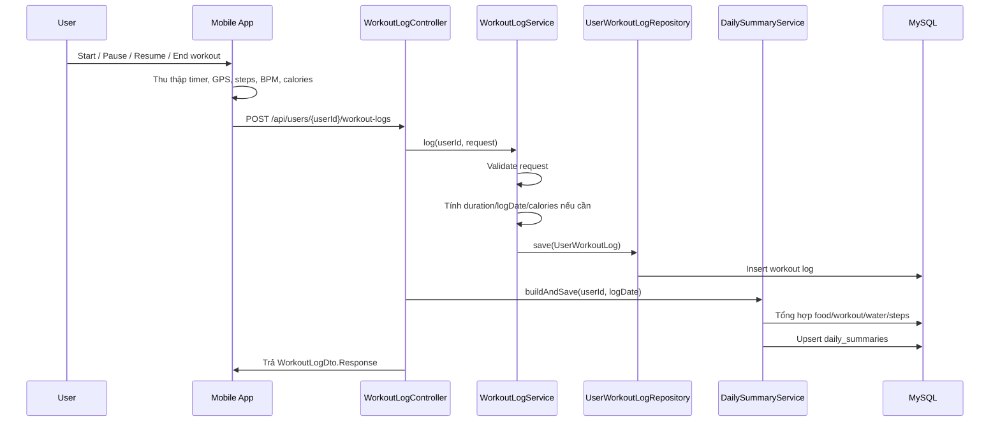
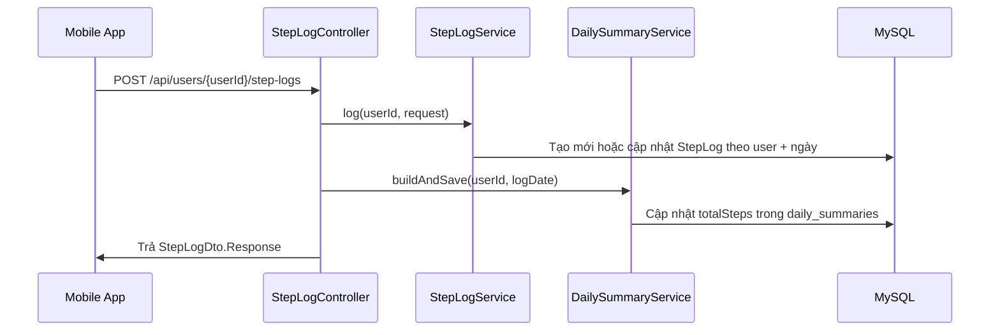

# Báo cáo kỹ thuật chức năng cá nhân: Luồng tập luyện, chỉ số sức khỏe, nhật ký và bước chân

## 1. Thông tin chung

- Hệ thống: Wao - ứng dụng theo dõi sức khỏe, dinh dưỡng và tập luyện.
- Repo backend: `Wao_be`.
- Công nghệ chính: Java Spring Boot, Spring Web, Spring Data JPA, Hibernate, MySQL, Lombok, Maven.
- Nhóm chức năng cá nhân phụ trách:
  - Phát triển luồng tập luyện: bắt đầu, tạm dừng, kết thúc bài tập chạy bộ, đạp xe, gym; ghi thời gian, quãng đường GPS và calo tiêu thụ.
  - Theo dõi chỉ số sức khỏe: nhận dữ liệu nhịp tim, số bước chân từ cảm biến/Health Connect/GPS do mobile app đồng bộ lên server.
  - Xem báo cáo nhật ký và bước chân: cung cấp dữ liệu lịch sử tập luyện, tổng bước chân, tổng calo và mức độ hoàn thành mục tiêu theo ngày/khoảng thời gian.

## 2. Danh sách chức năng được phân công

### 2.1. Luồng tập luyện

Chức năng cho phép người dùng thực hiện một phiên tập luyện với các loại hoạt động như đi bộ/chạy bộ ngoài trời, chạy bộ trong nhà, đạp xe và các bài tập khác. Trong phạm vi backend, hệ thống không trực tiếp điều khiển timer, GPS hoặc cảm biến. Mobile app là nơi quản lý trạng thái bắt đầu/tạm dừng/tiếp tục/kết thúc và thu thập dữ liệu theo thời gian thực. Backend nhận dữ liệu sau khi người dùng kết thúc phiên tập luyện, kiểm tra hợp lệ, lưu vào cơ sở dữ liệu và cập nhật tổng kết ngày.

Dữ liệu phiên tập luyện gồm:

- Loại hoạt động: `OUTDOOR_WALKING`, `OUTDOOR_RUNNING`, `INDOOR_RUNNING`, `CYCLING`, `OUTDOOR_CYCLING`, `OTHER`.
- Thời gian bắt đầu và kết thúc: `startedAt`, `endedAt`.
- Thời lượng: `durationMin`, có thể được backend tự tính từ `startedAt` và `endedAt`.
- Quãng đường: `distanceMeters`, thường lấy từ GPS.
- Tốc độ trung bình/tối đa: `avgSpeedKmh`, `maxSpeedKmh`.
- Calo tiêu thụ: `caloriesBurned`, có thể lấy từ Health Connect/mobile hoặc được backend ước tính theo bài tập.
- Số bước trong phiên tập: `stepCount`.
- Nhịp tim trung bình/tối đa: `avgHeartRate`, `maxHeartRate`.
- Nguồn dữ liệu: `GPS`, `HEALTH_CONNECT`, `SENSOR`, `ESTIMATED`, `MANUAL`.

### 2.2. Theo dõi chỉ số sức khỏe

Hệ thống hỗ trợ nhận và lưu dữ liệu sức khỏe được đồng bộ từ thiết bị/mobile client:

- Tổng số bước chân theo ngày qua API `step-logs`.
- Số bước riêng của từng phiên tập qua `workout-logs.stepCount`.
- Nhịp tim trung bình/tối đa trong phiên tập qua `avgHeartRate`, `maxHeartRate`.
- Nguồn dữ liệu được lưu kèm để phân biệt dữ liệu lấy từ GPS, Health Connect, cảm biến hoặc nhập thủ công.

Lưu ý kỹ thuật: backend hiện không gọi trực tiếp Android Health Connect SDK hoặc GPS SDK. Các SDK này thuộc tầng mobile app. Backend đóng vai trò nhận dữ liệu đã được mobile app thu thập/tính toán, sau đó lưu trữ và tổng hợp.

### 2.3. Nhật ký tập luyện và báo cáo bước chân

Backend cung cấp dữ liệu cho màn hình nhật ký/báo cáo:

- Xem danh sách phiên tập theo ngày.
- Xem lịch sử tập luyện theo khoảng ngày.
- Xem tổng hợp tập luyện theo nhóm bài tập/chương trình/loại hoạt động.
- Xem tổng số bước chân theo ngày hoặc khoảng ngày.
- Xem tổng kết ngày gồm calo nạp vào, calo tiêu hao, lượng nước, tổng bước chân và trạng thái hoàn thành mục tiêu.

Frontend có thể dùng dữ liệu này để vẽ biểu đồ cột/đường theo ngày, tuần hoặc tháng.

## 3. Kiến trúc chi tiết hệ thống

### 3.1. Kiến trúc tổng quan

Hệ thống được tổ chức theo mô hình nhiều lớp của Spring Boot:

```text
Mobile App
  |
  | REST API
  v
Controller Layer
  |
  v
Service Layer
  |
  v
Repository Layer
  |
  v
MySQL Database
```

Vai trò từng lớp:

- `Controller`: nhận HTTP request, đọc `userId`, query params và request body, sau đó gọi service tương ứng.
- `Service`: chứa nghiệp vụ chính như validate dữ liệu, tính thời lượng, tính calo, gom nhóm thống kê, cập nhật tổng kết ngày.
- `Repository`: truy vấn dữ liệu qua Spring Data JPA.
- `Entity`: ánh xạ bảng trong cơ sở dữ liệu.
- `DTO`: định nghĩa request/response contract giữa backend và mobile app.
- `Mapper`: chuyển entity sang DTO response.

### 3.2. Luồng lưu phiên tập luyện



### 3.3. Luồng đồng bộ bước chân



### 3.4. Luồng xem nhật ký/báo cáo

Mobile app gọi các API đọc dữ liệu:

- `GET /api/users/{userId}/workout-logs/history?from=YYYY-MM-DD&to=YYYY-MM-DD` để lấy từng phiên tập.
- `GET /api/users/{userId}/workout-logs/summary?from=YYYY-MM-DD&to=YYYY-MM-DD` để lấy dữ liệu tổng hợp theo loại hoạt động/bài tập/chương trình.
- `GET /api/users/{userId}/step-logs?from=YYYY-MM-DD&to=YYYY-MM-DD` để lấy bước chân theo ngày.
- `GET /api/users/{userId}/daily-summaries/history?from=YYYY-MM-DD&to=YYYY-MM-DD` để lấy tổng kết ngày phục vụ biểu đồ.

## 4. Code đáp ứng chức năng

### 4.1. Nhóm code luồng tập luyện

| File | Vai trò |
|---|---|
| `src/main/java/com/example/wao_be/controller/WorkoutLogController.java` | Định nghĩa API tạo, xem, xóa workout log; sau khi tạo/xóa thì refresh daily summary. |
| `src/main/java/com/example/wao_be/service/WorkoutLogService.java` | Xử lý nghiệp vụ workout: validate request, xác định loại hoạt động, tính duration, tính log date, tính calo, gom nhóm summary. |
| `src/main/java/com/example/wao_be/dto/WorkoutLogDto.java` | Định nghĩa request/response cho workout log và summary. |
| `src/main/java/com/example/wao_be/entity/UserWorkoutLog.java` | Entity ánh xạ bảng `user_workout_logs`, lưu phiên tập luyện và các chỉ số tracking. |
| `src/main/java/com/example/wao_be/repository/UserWorkoutLogRepository.java` | Query workout theo ngày/khoảng ngày, tính tổng calo/quãng đường/bước chân. |
| `src/main/java/com/example/wao_be/mapper/WorkoutLogMapper.java` | Map dữ liệu từ entity sang response trả về frontend. |

Các hàm chính trong `WorkoutLogService`:

| Hàm | Mô tả |
|---|---|
| `log(Long userId, WorkoutLogDto.Request req)` | Tạo workout log mới, lưu các chỉ số tập luyện và trả response. |
| `validateRequest(WorkoutLogDto.Request req)` | Kiểm tra điều kiện hợp lệ: thời gian bắt đầu/kết thúc, duration, activity type, heart rate, speed. |
| `resolveActivityType(...)` | Hợp nhất `activityType` và `workoutType` để lưu vào `activity_type`. |
| `resolveDurationMin(...)` | Nếu request không gửi `durationMin`, backend tự tính từ `startedAt` và `endedAt`. |
| `resolveLogDate(...)` | Nếu không gửi `logDate`, backend lấy ngày từ `startedAt`. |
| `resolveCaloriesBurned(...)` | Nếu có `caloriesBurned` thì dùng trực tiếp; nếu không, backend có thể ước tính từ `Exercise.caloriesPerMin * durationMin`. |
| `getByUserAndDate(...)` | Lấy workout log theo một ngày. |
| `getByUserAndDateRange(...)` | Lấy lịch sử workout trong khoảng ngày. |
| `getSummary(...)` | Gom nhóm workout theo bài tập/chương trình/loại hoạt động và tính tổng session, duration, calories, distance, steps. |
| `delete(...)` | Xóa workout log của user và trả về ngày log để controller refresh daily summary. |

### 4.2. Nhóm code theo dõi bước chân

| File | Vai trò |
|---|---|
| `src/main/java/com/example/wao_be/controller/StepLogController.java` | Định nghĩa API ghi và đọc step log. |
| `src/main/java/com/example/wao_be/service/StepLogService.java` | Tạo mới hoặc cập nhật số bước theo ngày. |
| `src/main/java/com/example/wao_be/dto/StepLogDto.java` | Định nghĩa request/response cho step log. |
| `src/main/java/com/example/wao_be/entity/StepLog.java` | Entity ánh xạ bảng `step_logs`. |
| `src/main/java/com/example/wao_be/repository/StepLogRepository.java` | Query step theo ngày/khoảng ngày và tính tổng bước. |

Các hàm chính trong `StepLogService`:

| Hàm | Mô tả |
|---|---|
| `log(Long userId, StepLogDto.Request req)` | Nếu user đã có step log trong ngày thì cập nhật, nếu chưa có thì tạo mới. |
| `getByUserAndDate(Long userId, LocalDate date)` | Lấy tổng số bước của một ngày. |
| `getByUserAndDateRange(Long userId, LocalDate from, LocalDate to)` | Lấy danh sách số bước trong khoảng ngày để frontend vẽ biểu đồ. |

### 4.3. Nhóm code daily summary và báo cáo

| File | Vai trò |
|---|---|
| `src/main/java/com/example/wao_be/controller/DailySummaryController.java` | API lấy tổng kết hôm nay, theo ngày, theo lịch sử và refresh thủ công. |
| `src/main/java/com/example/wao_be/service/DailySummaryService.java` | Tổng hợp dữ liệu từ food log, workout log, water log, step log để lưu vào `daily_summaries`. |
| `src/main/java/com/example/wao_be/dto/DailySummaryDto.java` | Response tổng kết ngày. |
| `src/main/java/com/example/wao_be/entity/DailySummary.java` | Entity bảng tổng hợp theo khóa chính `user_id + log_date`. |
| `src/main/java/com/example/wao_be/repository/DailySummaryRepository.java` | Query daily summary theo ngày/khoảng ngày. |

Các hàm chính trong `DailySummaryService`:

| Hàm | Mô tả |
|---|---|
| `buildAndSave(Long userId, LocalDate date)` | Tổng hợp dữ liệu trong ngày và lưu/cập nhật bảng `daily_summaries`. |
| `getByUserAndDate(Long userId, LocalDate date)` | Lấy tổng kết một ngày. |
| `getHistory(Long userId, LocalDate from, LocalDate to)` | Lấy lịch sử tổng kết ngày để frontend hiển thị chart. |

## 5. API liên quan

### 5.1. API tạo workout log

```http
POST /api/users/{userId}/workout-logs
```

Request mẫu:

```json
{
  "workoutType": "OUTDOOR_RUNNING",
  "startedAt": "2026-05-27T06:30:00",
  "endedAt": "2026-05-27T07:00:00",
  "distanceMeters": 4200.0,
  "avgSpeedKmh": 8.4,
  "maxSpeedKmh": 11.2,
  "stepCount": 5200,
  "avgHeartRate": 132,
  "maxHeartRate": 164,
  "caloriesBurned": 310.5,
  "distanceSource": "GPS",
  "stepSource": "HEALTH_CONNECT",
  "heartRateSource": "SENSOR",
  "caloriesSource": "HEALTH_CONNECT",
  "note": "Morning run"
}
```

Response chính:

```json
{
  "id": 1,
  "userId": 10,
  "activityType": "OUTDOOR_RUNNING",
  "workoutType": "OUTDOOR_RUNNING",
  "durationMin": 30,
  "caloriesBurned": 310.5,
  "distanceMeters": 4200.0,
  "avgSpeedKmh": 8.4,
  "maxSpeedKmh": 11.2,
  "stepCount": 5200,
  "avgHeartRate": 132,
  "maxHeartRate": 164,
  "logDate": "2026-05-27",
  "startedAt": "2026-05-27T06:30:00",
  "endedAt": "2026-05-27T07:00:00"
}
```

### 5.2. API xem workout theo ngày

```http
GET /api/users/{userId}/workout-logs?date=YYYY-MM-DD
```

Mục đích: lấy danh sách phiên tập của một ngày.

### 5.3. API xem lịch sử workout

```http
GET /api/users/{userId}/workout-logs/history?from=YYYY-MM-DD&to=YYYY-MM-DD
```

Mục đích: lấy danh sách từng phiên tập trong khoảng ngày. Dữ liệu được sort theo phiên mới nhất trước.

### 5.4. API xem tổng hợp workout

```http
GET /api/users/{userId}/workout-logs/summary?from=YYYY-MM-DD&to=YYYY-MM-DD
```

Mục đích: lấy dữ liệu đã gom nhóm theo `EXERCISE`, `PROGRAM` hoặc `ACTIVITY`, phục vụ màn hình workout journal và biểu đồ tổng hợp.

### 5.5. API ghi step log

```http
POST /api/users/{userId}/step-logs
```

Request mẫu:

```json
{
  "stepCount": 8500,
  "logDate": "2026-05-27"
}
```

Mục đích: đồng bộ tổng số bước trong ngày. Nếu đã có bản ghi của ngày đó, hệ thống cập nhật bản ghi cũ thay vì tạo bản ghi trùng.

### 5.6. API xem step log

```http
GET /api/users/{userId}/step-logs/date?date=YYYY-MM-DD
GET /api/users/{userId}/step-logs?from=YYYY-MM-DD&to=YYYY-MM-DD
```

Mục đích: lấy tổng số bước theo ngày hoặc theo khoảng ngày để frontend hiển thị biểu đồ.

### 5.7. API xem daily summary

```http
GET /api/users/{userId}/daily-summaries/today
GET /api/users/{userId}/daily-summaries?date=YYYY-MM-DD
GET /api/users/{userId}/daily-summaries/history?from=YYYY-MM-DD&to=YYYY-MM-DD
POST /api/users/{userId}/daily-summaries/refresh?date=YYYY-MM-DD
```

Mục đích: lấy hoặc tính lại tổng kết ngày gồm `totalCalIn`, `totalCalOut`, `netCalories`, `totalWater`, `totalSteps`, `isGoalAchieved`.

## 6. Bảng trong cơ sở dữ liệu

### 6.1. Bảng `user_workout_logs`

Bảng lưu từng phiên tập luyện của user.

| Cột | Ý nghĩa |
|---|---|
| `id` | Khóa chính. |
| `user_id` | User thực hiện phiên tập. |
| `exercise_id` | Bài tập cụ thể, có thể null nếu là tracking theo hoạt động. |
| `program_id` | Chương trình tập, có thể null. |
| `activity_type` | Loại hoạt động như running, cycling, walking. |
| `duration_min` | Thời lượng tập tính bằng phút. |
| `calories_burned` | Calo tiêu thụ. |
| `distance_meters` | Quãng đường tính bằng mét. |
| `avg_speed_kmh` | Tốc độ trung bình. |
| `max_speed_kmh` | Tốc độ tối đa. |
| `step_count` | Số bước trong phiên tập. |
| `avg_heart_rate` | Nhịp tim trung bình. |
| `max_heart_rate` | Nhịp tim tối đa. |
| `calories_source` | Nguồn dữ liệu calo. |
| `distance_source` | Nguồn dữ liệu quãng đường. |
| `step_source` | Nguồn dữ liệu bước chân. |
| `heart_rate_source` | Nguồn dữ liệu nhịp tim. |
| `log_date` | Ngày ghi nhận phiên tập. |
| `started_at` | Thời gian bắt đầu. |
| `ended_at` | Thời gian kết thúc. |
| `note` | Ghi chú. |
| `created_at` | Thời gian tạo bản ghi. |

Migration liên quan:

- `src/main/resources/migrations/V2__extend_user_workout_logs_for_tracking.sql`
- `src/main/resources/migrations/V3__extend_user_workout_logs_for_history_and_summary.sql`
- `src/main/resources/migrations/V4__add_cycling_activity_type_to_user_workout_logs.sql`

### 6.2. Bảng `step_logs`

Bảng lưu tổng số bước theo ngày.

| Cột | Ý nghĩa |
|---|---|
| `id` | Khóa chính. |
| `user_id` | User sở hữu dữ liệu. |
| `step_count` | Tổng số bước trong ngày. |
| `log_date` | Ngày ghi nhận. |

### 6.3. Bảng `daily_summaries`

Bảng tổng hợp dữ liệu theo ngày. Khóa chính gồm `user_id` và `log_date`.

| Cột | Ý nghĩa |
|---|---|
| `user_id` | User sở hữu dữ liệu tổng kết. |
| `log_date` | Ngày tổng kết. |
| `total_cal_in` | Tổng calo nạp vào từ food log. |
| `total_cal_out` | Tổng calo tiêu hao từ workout log. |
| `total_water` | Tổng nước uống trong ngày. |
| `total_steps` | Tổng bước chân trong ngày từ `step_logs`. |
| `is_goal_achieved` | Trạng thái đạt mục tiêu ngày. |

## 7. Xử lý nghiệp vụ quan trọng

### 7.1. Validate phiên tập luyện

Backend kiểm tra các điều kiện:

- Không gửi đồng thời `exerciseId` và `programId`.
- Phải có ít nhất một trong `exerciseId`, `programId`, `activityType`, `workoutType`.
- Nếu có dữ liệu tracking như distance, steps, heart rate, speed, startedAt hoặc endedAt thì phải có loại hoạt động.
- `startedAt` và `endedAt` phải đi cùng nhau.
- `endedAt` phải sau `startedAt`.
- Nếu không gửi `durationMin`, backend yêu cầu có đủ `startedAt` và `endedAt` để tự tính.
- `avgSpeedKmh` không được lớn hơn `maxSpeedKmh`.
- `avgHeartRate` không được lớn hơn `maxHeartRate`.

### 7.2. Tính thời lượng

Nếu request đã có `durationMin`, backend dùng giá trị đó. Nếu không, backend tính:

```text
durationMin = Duration.between(startedAt, endedAt).toMinutes()
```

### 7.3. Tính calo

Backend ưu tiên dùng `caloriesBurned` do mobile app gửi lên. Nếu không có, và phiên tập gắn với một `Exercise` có `caloriesPerMin`, backend tính:

```text
caloriesBurned = exercise.caloriesPerMin * durationMin
```

Với các phiên tập tracking ngoài trời như chạy/đạp xe/đi bộ, calo thường do mobile app hoặc Health Connect tính rồi gửi lên backend.

### 7.4. Đồng bộ daily summary

Sau khi tạo hoặc xóa workout log, hoặc sau khi cập nhật step log, controller gọi:

```java
dailySummaryService.buildAndSave(userId, logDate);
```

Hàm này tổng hợp:

- `totalCalIn` từ `user_food_logs`.
- `totalCalOut` từ `user_workout_logs`.
- `totalWater` từ `user_water_logs`.
- `totalSteps` từ `step_logs`.
- `isGoalAchieved` dựa trên mục tiêu trong health profile.

## 8. Hướng dẫn cài đặt và triển khai

### 8.1. Yêu cầu môi trường

- JDK 17 hoặc phiên bản phù hợp với cấu hình trong `pom.xml`.
- Maven hoặc Maven Wrapper có sẵn trong repo.
- MySQL đang chạy và có database cho ứng dụng.
- Cấu hình kết nối database trong `src/main/resources/application.properties`.

### 8.2. Cài đặt dependency

Ở thư mục gốc backend:

```powershell
.\mvnw clean install
```

### 8.3. Chạy ứng dụng

```powershell
.\mvnw spring-boot:run
```

Ứng dụng backend mặc định chạy theo cấu hình trong `application.properties`.

### 8.4. Migration database

Trước khi chạy các API workout tracking, cần đảm bảo các migration sau đã được áp dụng:

- `V2__extend_user_workout_logs_for_tracking.sql`
- `V3__extend_user_workout_logs_for_history_and_summary.sql`
- `V4__add_cycling_activity_type_to_user_workout_logs.sql`

Nếu database chưa có các cột như `activity_type`, `distance_meters`, `started_at`, `ended_at`, `step_source`, `created_at`, các API workout tracking sẽ lỗi khi lưu dữ liệu.

### 8.5. Lưu ý tích hợp với mobile app

- Mobile app chịu trách nhiệm start/pause/resume/end timer và thu thập GPS/cảm biến theo thời gian thực.
- Backend chỉ lưu dữ liệu khi mobile app gọi API sau khi kết thúc hoặc đồng bộ phiên tập.
- Với tổng bước chân ngày, mobile app cần gọi `POST /api/users/{userId}/step-logs`.
- Với số bước riêng của buổi tập, mobile app gửi `stepCount` trong `POST /workout-logs`.
- `daily_summaries.totalSteps` hiện lấy từ bảng `step_logs`, không lấy trực tiếp từ `user_workout_logs.step_count`.
- Nếu muốn vẽ biểu đồ bước chân theo từng giờ từ server, cần bổ sung thêm bảng timeline/bucket theo giờ. Backend hiện mới lưu tổng bước theo ngày.

## 9. Phần code cá nhân thực hiện

Các file liên quan trực tiếp đến nội dung cá nhân:

| Nhóm | File |
|---|---|
| Workout API | `WorkoutLogController.java` |
| Workout nghiệp vụ | `WorkoutLogService.java` |
| Workout DTO | `WorkoutLogDto.java` |
| Workout entity | `UserWorkoutLog.java` |
| Workout repository | `UserWorkoutLogRepository.java` |
| Workout mapper | `WorkoutLogMapper.java` |
| Step API | `StepLogController.java` |
| Step nghiệp vụ | `StepLogService.java` |
| Step DTO | `StepLogDto.java` |
| Step entity | `StepLog.java` |
| Step repository | `StepLogRepository.java` |
| Daily summary API | `DailySummaryController.java` |
| Daily summary nghiệp vụ | `DailySummaryService.java` |
| Daily summary DTO/entity | `DailySummaryDto.java`, `DailySummary.java` |
| Database migration | `V2__extend_user_workout_logs_for_tracking.sql`, `V3__extend_user_workout_logs_for_history_and_summary.sql`, `V4__add_cycling_activity_type_to_user_workout_logs.sql` |

Mô tả phạm vi code:

- Bổ sung dữ liệu tracking cho workout log: loại hoạt động, thời gian bắt đầu/kết thúc, quãng đường, tốc độ, bước chân, nhịp tim và nguồn dữ liệu.
- Xây dựng API lưu workout session trực tiếp bằng `activityType/workoutType`, không bắt buộc phải tạo `Exercise` mới.
- Bổ sung API xem lịch sử và tổng hợp workout để phục vụ màn hình nhật ký.
- Bổ sung API ghi và đọc tổng bước chân theo ngày.
- Cập nhật daily summary sau khi dữ liệu workout hoặc step thay đổi.
- Bổ sung migration để mở rộng schema bảng `user_workout_logs`.

## 10. Kết luận

Nhóm chức năng cá nhân đã xây dựng phần backend phục vụ quá trình ghi nhận và báo cáo tập luyện/sức khỏe. Backend nhận dữ liệu workout, GPS, bước chân và nhịp tim từ mobile app, kiểm tra hợp lệ, lưu vào các bảng tương ứng và cập nhật bảng tổng hợp ngày. Các API lịch sử, summary và step log cung cấp dữ liệu cần thiết để frontend hiển thị nhật ký, biểu đồ tập luyện và mức độ hoàn thành mục tiêu của người dùng.
